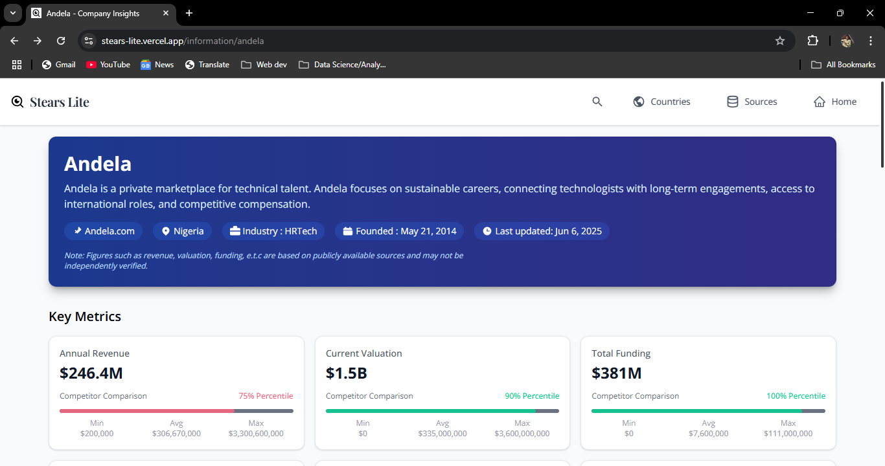

# 📊 Stears Lite – African Company Insights Dashboard

**Stears Lite** is a full-stack dashboard that provides structured, up-to-date insights into African companies. Inspired by [Stears Africa](https://stears.co), this project combines web scraping, caching, and responsive design to deliver company data in a clean and accessible format.


## 🔍 Search Interface Preview

<p align="center">
  
  <br />
  
</p>

---

## 🔗 Repositories

| Component      | Link                                                                 |
|----------------|----------------------------------------------------------------------|
| 🌐 Frontend     | [stears-lite-frontend](https://github.com/Toluwaa-o/stears-lite) |
| ⚙️ Backend       | [stears-lite-backend](https://github.com/Toluwaa-o/lite-api)   |

---

## 🎯 Features

- 🔍 Company search interface with instant display
- 📊 Displays insights such as industry, founding year, country, funding, revenue, and more
- ⚡ Automatic caching to avoid redundant scraping
- 🌐 Built with modern, scalable technologies (Next.js + FastAPI)
- 🧪 MongoDB backend with auto-updated timestamps

---

## 🧱 Tech Stack

- **Frontend**: Next.js, Tailwind CSS
- **Backend**: FastAPI, Pymongo, BeautifulSoup
- **Database**: MongoDB Atlas
- **Deployment**: Vercel (frontend), Render (backend)

---

## 🚀 Getting Started

### Prerequisites

- Node.js + npm or yarn
- Python 3.9+
- MongoDB Atlas URI

### Clone Repos

```bash
git clone https://github.com/Toluwaa-o/stears-lite
git clone https://github.com/Toluwaa-o/lite-api
````

### Run Frontend

```bash
cd stears-lite
npm install
npm run dev
```

### Run Backend

```bash
cd lite-api
pip install -r requirements.txt
uvicorn app.main:app --reload
```

Update your `.env` file in the backend with your MongoDB URI and other variables:

```
MONGO_URI=your_mongodb_uri_here
MONGO_DB=your_mongodb_name_here
MONGO_COLLECTION=your_mongodb_collection_here
LITE_API=backend_api_link_here
NEXT_PUBLIC_BACKEND_URL=next_api_url_here
```

---

## 📸 Screenshots

<div align="center">
  
  
</div>

---

## 🌍 Live Demo

[🔗 View Deployed Project](https://stears-lite.vercel.app/)

---

## 📌 Note

> ⚠️ Data is collected via scraping and may not be independently verified. Minor or Major variations from official sources may occur.

---

## 📘 Inspiration

This project is inspired by [Stears Africa](https://stears.co) and was built to showcase:

* End-to-end web development
* Data scraping and transformation
* Backend API design
* Frontend data visualization

---

## 👨‍💻 Author

Built by [Toluwalashe Ogunleye](https://tolu-portfolio.vercel.app/)
Feel free to connect, fork, or star if you find it useful!